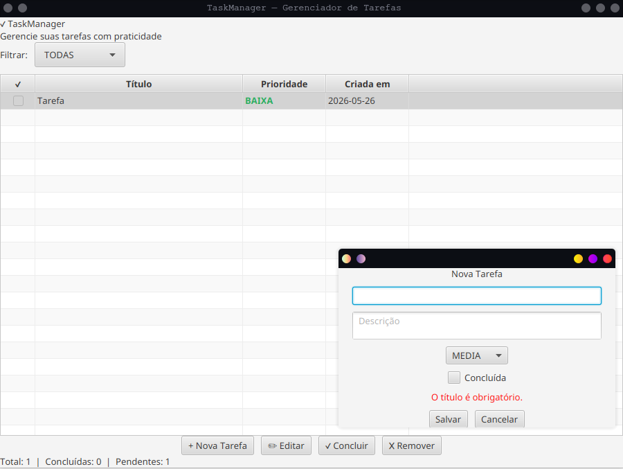

# TaskManager — Gerenciador de Tarefas

Aplicação desktop para gerenciamento de tarefas desenvolvida em Java com JavaFX, persistência em MariaDB via JDBC, estrutura genérica com Generics e testes automatizados com JUnit 5.



---

## Tecnologias

| Tecnologia | Versão | Uso |
|---|---|---|
| Java | 21 | Linguagem principal |
| JavaFX | 21 | Interface gráfica |
| MariaDB | qualquer | Banco de dados da aplicação |
| JDBC | — | Acesso ao banco |
| Maven | 3.8+ | Build e dependências |
| JUnit 5 | 5.10.2 | Testes automatizados |
| SQLite (in-memory) | 3.45 | Banco isolado para os testes |

---

## Pré-requisitos

- Java 21 instalado e no PATH
- Maven 3.8+ instalado
- MariaDB instalado e rodando (apenas para executar a aplicação)

Verifique as versões:
```bash
java -version
mvn -version
mariadb --version
```

---

## 1. Configurar o banco de dados

Execute o script SQL na raiz do projeto **uma única vez**:

```bash
sudo mariadb -u root < banco.sql
```

Esse script cria automaticamente:
- O banco `taskmanager`
- O usuário `iuri` com senha `123456`
- A tabela `tarefas`
- Um registro de exemplo

> Se o seu MariaDB tiver senha no root, use: `sudo mariadb -u root -p < banco.sql`

---

## 2. Rodar os testes

Os testes **não dependem do MariaDB** — usam SQLite em memória e rodam em qualquer máquina:

```bash
mvn test
```

Resultado esperado:

```
Tests run: 33, Failures: 0, Errors: 0, Skipped: 0
BUILD SUCCESS
```

São 33 testes divididos em:
- `TarefaTest` — 14 testes do modelo (criação, validação, conclusão)
- `TarefaDAOTest` — 11 testes do DAO com SQLite em memória
- `RepositorioGenericoTest` — 8 testes da classe genérica

---

## 3. Executar a aplicação

Com o banco configurado (passo 1), rode:

```bash
mvn javafx:run
```

A janela do TaskManager abrirá com a lista de tarefas.

---

## Estrutura do projeto

```
TaskManager/
├── src/
│   ├── main/
│   │   ├── java/com/taskmanager/
│   │   │   ├── app/           # MainApplication (entry point JavaFX)
│   │   │   ├── controller/    # MainController, FormController
│   │   │   ├── dao/           # TarefaDAO (JDBC)
│   │   │   ├── db/            # Conexao (gerencia conexão MariaDB)
│   │   │   ├── generic/       # Repositorio<T,ID>, RepositorioGenerico<T>
│   │   │   └── model/         # Tarefa
│   │   └── resources/
│   │       └── com/taskmanager/
│   │           ├── css/       # style.css
│   │           └── fxml/      # main-view.fxml, form-view.fxml
│   └── test/
│       └── java/com/taskmanager/
│           ├── TarefaTest.java
│           ├── TarefaDAOTest.java
│           └── RepositorioGenericoTest.java
├── banco.sql                  # Script de criação do banco
├── pom.xml
└── README.md
```

---

## Funcionalidades

- **Listar tarefas** com filtro por status (Todas / Pendentes / Concluídas)
- **Criar tarefa** com título, descrição e prioridade (Alta / Média / Baixa)
- **Editar tarefa** existente
- **Marcar como concluída**
- **Remover tarefa** com confirmação
- Prioridades destacadas por cor na tabela
- Contador de tarefas na barra de status
